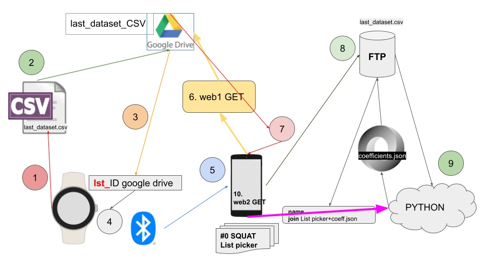

# WELCOME to WOW (WatchOwnWorkout)

The idea stems from the intention to create an application for smartwatches that can automatically track weight training, counting repetitions and other parameters.

We want to help the professional or non-professional athlete calculate their 1RM max for classic multi-joint exercises, such as squats, bench presses, rowing etc. and starting from that data, suggest the correct (estimated) weight to use.

For this project, we will use the Python programming language and current machine learning and classification libraries.

